<!-- README.md is generated from README.Rmd. Please edit that file -->


Investigating the properties of the earthquake frequency-magnitude distribution (FMD) is the first necessary step of any seismicity analysis. The R package rseismNet provides a suite of statistical functions to determine the completeness magnitude $m_c$ and the seismicity properties below and above this threshold. "Net" refers to network, (1) for the seismic network properties described by the FMD shape below $m_c$, and (2) for the earthquake fault network properties described by the Gutenberg-Richter law above $m_c$. rseismNet also implements the Bayesian Magnitude of Completeness (BMC) method (Mignan et al., 2011, doi: 10.1785/0120100223), which maps $m_c$ based on a seismic network prior.

What rseismNet does:

- Computes the FMD, $m_c$ and the slope of the Gutenberg-Richter law $\beta$ for any seismicity dataset;
- Maps $m_c$ using different methods;
- Generates the BMC prior and BMC maps (observed, predicted, posterior) of $m_c$ and related uncertainties;
- Simulates seismicity for two FMD shapes (angular and curved).

What rseismNet needs:

- An earthquake magnitude vector, which can be simulated directly in rseismNet;
- For $m_c$ mapping, an earthquake catalogue with at least longitudes, latitudes and magnitudes;
- For the BMC method, the station coordinates of the seismic nework from which the earthquake catalogue was generated.

## Installation

You can install rseismNet from github with:


```r
# install.packages("devtools")
devtools::install_github("amignan/rseismNet")
```

## Basic functions

The following example makes use of all the basic functions of rseismNet, which are listed in `R/fmd.R`. It shows how to estimate the completeness magnitude $m_c$ from frequency magnitude distribution (FMDs) of different shapes, and how to avoid biased estimates of $\beta$. Accurate estimates of $\beta$ are important in seismic hazard assessment, as the probability of large and potentially damaging earthquakes is extrapolated from the value $\beta$ takes. A correct estimation of $m_c$ is also important in general seismicity statistics in order to maximize the sample size.

Let us first generate two earthquake magnitude vectors drawn from two different FMD models.


```r
    n_eq <- 1e4
    theta_curved <- list(beta = log(10), mu = 2, sigma = 0.5)
    theta_angular <- list(kappa = 3 * log(10), beta = log(10), mc = 2)
    m_curved <- rseismNet::bfmd.sim(n_eq, theta_curved)
    m_angular <- rseismNet::efmd.sim(n_eq, theta_angular)
```

The vector `m_curved` is drawn from the FMD model first proposed by Ringdal (1975) and further developed by Ogata & Katsura (1993; 2006) by using the function `bfmd.sim` ("b" for bulk). The vector `m_angular` is drawn from the FMD model proposed by Mignan (2012) by using the function `efmd.sim` ("e" for elemental). The difference between the two models becomes clear once their FMD (computed with the function `fmd`) is plotted:


```r
mdistr_curved <- rseismNet::fmd(m_curved)
mdistr_angular <- rseismNet::fmd(m_angular)
plot(mdistr_curved$mi, mdistr_curved$Ni, log = "y", col = "grey", main = "curved FMD")
points(mdistr_curved$mi, mdistr_curved$ni)
plot(mdistr_angular$mi, mdistr_angular$Ni, log = "y", col = "grey", main = "angular FMD")
points(mdistr_angular$mi, mdistr_angular$ni)
```

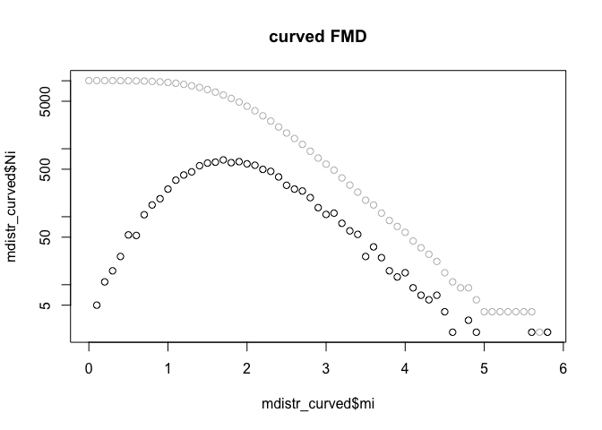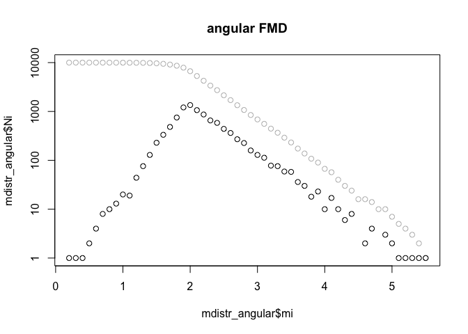

The first model leads to a curved FMD shape in the log-lin space, while the second one leads to an angular shape. Both models are of the form $n(m) \propto exp(-\beta m)q(m)$, the product of the theoretical Gutenberg-Richter law with slope $\beta = b\log(10)$ (Gutenberg & Richter, 1944) and a detection function $q(m)$, which gives the probability of a given magnitude $m$ being observed. In the first case, $q(m) = \mathcal{N}(\mu,\,\sigma^2)$, the cumulative Normal distribution, and in the second, $q(m < m_c) = exp(\kappa(m-m_c))$, an exponential function with detection parameter $\kappa > \beta$ and $q(m \geq m_c) = 1$. To learn more about the FMD shape ontology and where a given model applies, read Mignan (2012) and Mignan & Chen (2016). For $q(m)$ defined as a Gamma distribution (not yet implemented in rseismNet), see Kijko & Smit (2017).

Then the completeness magnitude $m_c$ is defined as the magnitude $m$ at which $q(m)$ tends to 1 (i.e., when all earthquakes are detected). For an angular FMD, $m_c$ is simply the mode of the distribution. For a curved FMD, $m_c$ is ambiguous and represented as $\mu+n\sigma$, but in practice it is approximated as the minimum magnitude above which a straight line is observed in log-lin space (i.e., above which the Gutenberg-Richter law is valid). Let us now evaluate $m_c$ by using three different methods, as defined in the function `mc.val`:


```r
mc_mode_curved <- rseismNet::mc.val(m_curved, "mode")
mc_mbass_curved <- rseismNet::mc.val(m_curved, "mbass")
mc_gft_curved <- rseismNet::mc.val(m_curved, "gft")
plot(mdistr_curved$mi, mdistr_curved$ni, log = "y", main = "mc of a curved FMD")
abline(v = c(mc_mode_curved, mc_mbass_curved, mc_gft_curved), col = c("orange", "red", "brown"), lty = c("solid", "dashed", "dotdash"))

mc_mode_angular <- rseismNet::mc.val(m_angular, "mode")
mc_mbass_angular <- rseismNet::mc.val(m_angular, "mbass")
mc_gft_angular <- rseismNet::mc.val(m_angular, "gft")
plot(mdistr_angular$mi, mdistr_angular$ni, log = "y", main = "mc of an angular FMD")
abline(v = c(mc_mode_angular, mc_mbass_angular, mc_gft_angular), col = c("orange", "red", "brown"), lty = c("solid", "dashed", "dotdash"))
```

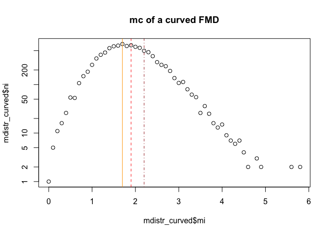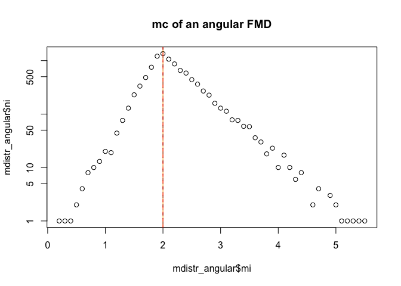

As of now, three FMD-based $m_c$ estimation methods are available in the `mc.val` function: 

- `mode` calculates the mode of the $m$ vector;
- `mbass` ("median-based analysis of the segment slope") determines the main breakpoints of the earthquake FMD. $m_c$ is defined as the change point that corresponds to the smallest probability of making an error when rejecting the null-hypothesis in a Wilcoxon-Mann-Whitney test (Amorese, 2007).
- `gft` estimates the goodness-of-fit between the cumulative number of earthquakes observed and predicted by the Gutenberg-Richter law. $m_c$ is defined as the lowest magnitude bin at which a fixed threshold $R$ is first met. $R$ is defined as a normalized absolute difference, fixed to 0.95. If the threshold is not reached, 0.90 is used. If again the threshold is not reached, the `mode` is used instead (Wiemer & Wyss, 2000).

Both the `mode` and `mbass` methods are non-parametric while `gft` depends on the fitting of the Gutenberg-Richter law. Let us now use the function `beta.mle` to calculate the Maximum Likelihood Estimate of $\beta$ (Aki, 1965) and check whether the obtained $m_c$ estimates are correct (knowing that `theta$beta = log(10)` was fixed for the simulations).

Since all methods here give the correct $m_c$ estimate for the angular FMD case (with `theta$mc = 2`), we retrieve a reasonable estimate of the $\beta$-value, with:


```r
beta_mode <- rseismNet::beta.mle(m_angular, mc_mode_angular)
beta_mode / log(10)
#> [1] 0.9808904
plot(mdistr_angular$mi, mdistr_angular$ni, log = "y", col = "grey", main = "Gutenberg-Richter law fit")
abline(v = mc_mode_angular, lty = "dotted", col = "red")
abline(a = log10(mdistr_angular$ni[which(mdistr_angular$mi >= mc_mode_angular)[1]]) + 
       beta_mode / log(10) * mc_mode_angular, b = -beta_mode / log(10), col = "red")
```

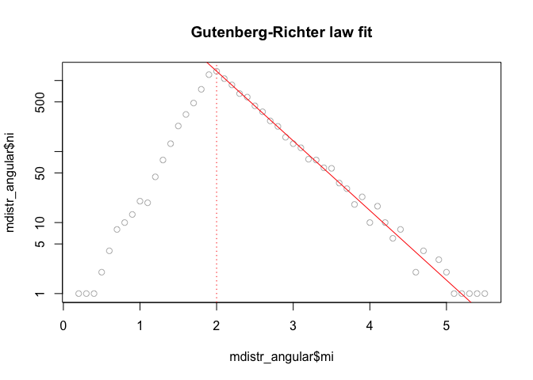<!-- -->

For a curved FMD however, the methods are likely to yield different $m_c$ estimates. The `mode` systematically underestimates it, leading in turn to an incorrect $\beta$-value:


```r
beta_mode_curved <- rseismNet::beta.mle(m_curved, mc_mode_curved)
beta_mbass_curved <- rseismNet::beta.mle(m_curved, mc_mbass_curved)
beta_gft_curved <- rseismNet::beta.mle(m_curved, mc_gft_curved)
c(beta_mode_curved, beta_mbass_curved, beta_gft_curved) / log(10)
#> [1] 0.7106344 0.7908075 0.8872886
plot(mdistr_curved$mi, mdistr_curved$ni, log = "y", col = "grey", main = "Gutenberg-Richter law biases")
abline(v = c(mc_mode_curved, mc_mbass_curved, mc_gft_curved), col = c("orange", "red", "brown"), lty = c("solid", "dashed", "dotdash"))
abline(a = log10(mdistr_curved$ni[which(mdistr_curved$mi >= mc_mode_curved)[1]]) + 
       beta_mode_curved / log(10) * mc_mode_curved, b = -beta_mode_curved / log(10), 
       col = "orange")
abline(a = log10(mdistr_curved$ni[which(mdistr_curved$mi >= mc_mbass_curved)[1]]) + 
       beta_mbass_curved / log(10) * mc_mbass_curved, b = -beta_mbass_curved / log(10), 
       col = "red", lty = "dashed")
abline(a = log10(mdistr_curved$ni[which(mdistr_curved$mi >= mc_gft_curved)[1]]) + 
       beta_gft_curved / log(10) * mc_gft_curved, b = -beta_gft_curved / log(10), 
       col = "brown", lty = "dotdash")
```

<!-- -->

The methods `mbass` and `gft` may also underestimate $m_c$, depending on the magnitude sample. To avoid this problem, it is recommended to estimate the properties of the $m_c$ estimator by bootstrapping. A conservative approach consists then in using the $m_c$ average plus one to three standard deviations (note that a slight overestimation of $m_c$ is less problematic than its underestimation, although increased undersampling will increase uncertainty on $\beta$):


```r
n_sample <- 100
mc_mbass_bootstrap <- sapply(1:n_sample, function(i) 
  rseismNet::mc.val(sample(m_curved, replace = T), "mbass"))
mean(mc_mbass_bootstrap, na.rm = T)
#> [1] 1.79
sd(mc_mbass_bootstrap, na.rm = T)
#> [1] 0.127525

mc_gft_bootstrap <- sapply(1:n_sample, function(i) 
  rseismNet::mc.val(sample(m_curved, replace = T), "gft"))
mean(mc_gft_bootstrap, na.rm = T)
#> [1] 2.189
sd(mc_gft_bootstrap, na.rm = T)
#> [1] 0.1355088

stddev <- seq(0,3,0.1)
mci_mbass <- round(mean(mc_mbass_bootstrap, na.rm = T) + stddev * sd(mc_mbass_bootstrap, na.rm = T), digits = 1)
beta_var_mbass <- sapply(1:length(stddev), function(i) rseismNet::beta.mle(m_curved, mci_mbass[i]))
mci_gft <- round(mean(mc_gft_bootstrap, na.rm = T) + stddev * sd(mc_gft_bootstrap, na.rm = T), digits = 1)
beta_var_gft <- sapply(1:length(stddev), function(i) rseismNet::beta.mle(m_curved, mci_gft[i]))

plot(stddev, beta_var_mbass, type = "l", col = "red", ylim = c(log(10) - 1, log(10) + .5), main = "beta sensitivity analysis")
lines(stddev, beta_var_gft, col = "brown")
abline(h = theta_curved$beta)
```

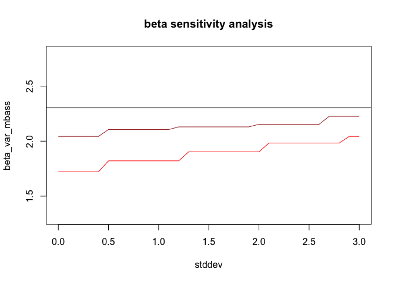<!-- -->

It is important to note that there is no "silver bullet"" method to estimate $m_c$. Two recommendations can be given: (1) Always use a visual help to decide whether a method appears reasonable or not (as shown in the various plots above); (2) Keep in mind that the result of a given method depends on the FMD shape, which may change for different data subsets (Mignan, 2012; Mignan & Chen, 2016). For a general review of FMD-based $m_c$ estimation methods, see Mignan and Woessner (2012). For further comparisons of `mbass` and `gft`, see Mignan and Chouliaras (2014).

## The Bayesian Magnitude of Completeness (BMC) mapping method

The following example makes use of all the mapping functions of rseismNet, which are listed in `R/bmc.R`. After showing various ways of mapping $m_c$ for a given earthquake catalogue, it describes the successive steps of the Bayesian Magnitude of Completeness (BMC) mapping method introduced by Mignan et al. (2011). BMC consists in computing an $m_c$ map that combines both observations and a seismic network prior. The BMC method has already been successfully tested in a number of regional catalogues (Kraft et al., 2013; Mignan et al., 2013; Vorobieva et al., 2013; Mignan and Chouliaras, 2014; Tormann et al., 2014; Panzera et al., 2017; Vasquez & Guenni, n.d.).

What are the advantages of using the BMC method?

- Fast FMD-based mapping approach;
- Limits the trade-off between undersampling and over-smoothing by optimizing the sample size based on the seismic network density;
- The optimized $m_c$ mapping minimizes $m_c$ heterogeneities in space, leading to more stable local $m_c$ estimates;
- Takes advantage of Bayes' Theorem to combine data and model, weighting them according to their uncertainties;
- The produced $m_c$ maps have no gaps, as the $m_c$ prior model is used wherever data is missing.

We first need an earthquake catalogue. We will use the southern California relocated earthquake catalogue of Hauksson et al. (2012), which is available on the Southern California Earthquake Data Center (SCEDC) website and we'll only consider the period 2001-2011.


```r
url <- "http://service.scedc.caltech.edu/ftp/catalogs/"
cat <- "hauksson/Socal_DD/hs_1981_2011_06_comb_K2_A.cat_so_SCSN_v01"
dat <- scan(paste(url, cat, sep = ""), what = "character", sep = "\n")
yr <- as.numeric(substr(dat, start=1, stop=4))
lat <- as.numeric(substr(dat, start=35, stop=42))
lon <- as.numeric(substr(dat, start=44, stop=53))
m <- as.numeric(substr(dat, start=63, stop=67))
seism <- data.frame(yr = yr, lon = lon,lat = lat, m = m)
seism <- subset(seism, yr >= 2001)
```

Two mapping methods are available in the function `mc.geogr` that do not involve the seismic network data. They are `grid` and `circle.cst`:


```r
mc.grid <- rseismNet::mc.geogr(seism, "mode", "grid", dbin = 0.1)
image(matrix(mc.grid$mc.obs, nrow=length(unique(mc.grid$lon)), ncol=length(unique(mc.grid$lat))), main = "high-res gridded obs. mc map")

mc.cst <- rseismNet::mc.geogr(seism, "mbass", "circle.cst", dbin = 0.1, R = 20)
image(matrix(mc.cst$mc.obs, nrow=length(unique(mc.cst$lon)), ncol=length(unique(mc.cst$lat))), main = "smoothed obs. mc map (R=30km)")
```

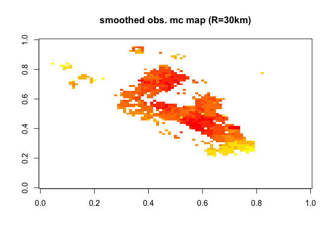

The `grid` method computes $m_c$ for earthquakes located in each cell of bin size `dbin` (in degrees). It will later be used in the BMC method for high-resolution mapping. The `circle.cst` method computes $m_c$ for earthquakes located in cylinders centered on each cell and with radius $R$ (in km). Note the difference between the two maps (here a low $m_c$ value is represented in red). The `mc.grid` map shows more details than `mc.cst`, as `mc.geogr` only requires 4 events or more per cell when computing $m_c$ with the mode (`nmin = 4` by default). If `mbass` or `gft` is used, `nmin = 50` by default. These thresholds were assessed from sensitivity tests in Mignan et al. (2011). No lower `nmin` value should be used to avoid instabilities. It is recommended to only use the `mode` for high-resolution mapping (`grid` method with low `dbin`) to avoid $m_c$ heterogeneities (increased heterogeneities lead to the FMD shape to change from angular to curved). For high `dbin` or high $R$, `gft` or `mbass` should be used instead (see previous example).

Let's now see the role of $R$ on $m_c$ mapping:


```r
mc.R50 <- rseismNet::mc.geogr(seism, "mbass", "circle.cst", dbin = 0.1, R = 50)
image(matrix(mc.R50$mc.obs, nrow=length(unique(mc.cst$lon)), ncol=length(unique(mc.cst$lat))), main = "smoothed obs. mc map (R=50km)")
mc.R75 <- rseismNet::mc.geogr(seism, "mbass", "circle.cst", dbin = 0.1, R = 75)
image(matrix(mc.R75$mc.obs, nrow=length(unique(mc.cst$lon)), ncol=length(unique(mc.cst$lat))), , main = "smoothed obs. mc map (R=75km)")
```

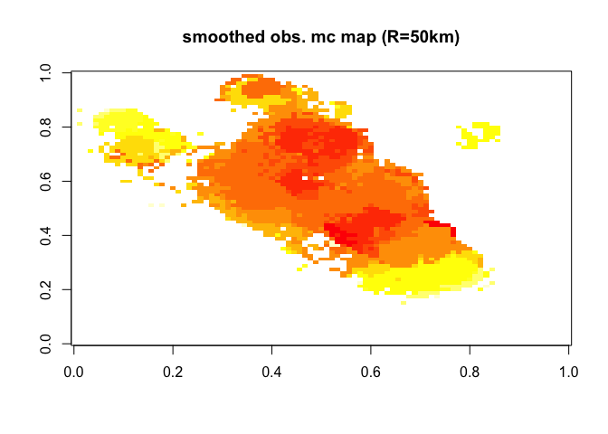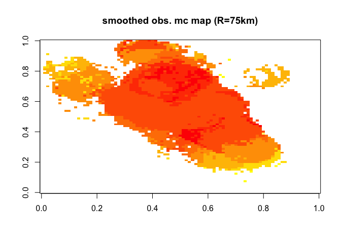

The greater is $R$, the higher is the smoothing of $m_c$. The BMC method avoids this problem while optimizing the number of events used to evalute $m_c$ per cell. It however requires the coordinates of the seismic stations (also available on the SCEDC website).


```r
url <- "http://service.scedc.caltech.edu/station/weblist.php"
dat <- scan(url, what = "character", sep = "\n", skip = 7)
network <- substr(dat, start = 1, stop = 2)
sta.name <- substr(dat, start = 5, stop = 9)
sta.lat <- as.numeric(substr(dat, start = 52, stop = 59))
#> Warning: NAs introduced by coercion
sta.lon <- as.numeric(substr(dat, start = 61, stop = 70))
#> Warning: NAs introduced by coercion
sta.on <- as.numeric(substr(dat, start = 78, stop = 81))
#> Warning: NAs introduced by coercion
sta.off <- as.numeric(substr(dat, start = 89, stop = 92))
stations <- data.frame(lon = sta.lon, lat = sta.lat, name = sta.name)
stations <- subset(stations, (network == "CI" & sta.off > min(seism$yr) & sta.on < max(seism$yr)))
stations <- subset(stations, (duplicated(name) == F))

res <- rseismNet::bmc(seism, stations, dbin = 0.1)   #BMC wrapper
#> Compute observed mc map (optimized) 
#> Compute predicted mc map (calibrated default prior model) 
#> Compute posterior mc map (combining both observed & predicted mc maps)
image(matrix(res$mc.post, nrow=length(unique(res$lon)), ncol=length(unique(res$lat))), main = "BMC map")
```

<!-- -->

We can see that there is no more gap in the BMC (posterior) $m_c$ map while local features have been kept (i.e. no over-smoothing). Now that we have seen the advantage of the BMC method with the wrapper function `bmc`, let us look in detail at the different BMC steps:

### Step 0: Prior definition

(if `support = "data"` in `bmc.prior`, or simply to learn more about the prior definition, otherwise jump directly to step 1)

The prior model is defined by the formula $m_c(d_k) = c_1 d_k^{c_2}+c_3$ with $d_k$ the distance to the $k^{th}$ nearest seismic station (in km) and $c_1$, $c_2$ and $c_3$ empirical parameters. $k$ represents the minimum number of stations required to trigger the declaration of an earthquake (usually between 3 and 5). The prior is obtained via the function `bmc.prior`. There are two options here: (i) Define the prior model from the data by fixing `support = "data"` or (ii) use directly the default prior model `bmc.prior.default`, calibrating it to the data by fixing `support = "calibrated"` in `bmc.prior` (see step 2).

Let us first have a look at this default BMC model:


```r
# create a synthetic seismic network
box <- c(-5, 5, -5, 5); dbin <- 0.1  #degrees
sta_n <- 30
stations_sim <- data.frame(lon = rnorm(sta_n), lat=rnorm(sta_n))

# define map grid
grid <- expand.grid(lon = seq(box[1], box[2], dbin), lat = seq(box[3], box[4], dbin))
grid.n <- nrow(grid)

# default prior:
kth <- 5
params <- rseismNet::bmc.prior.default(kth)
di <- seq(0, 200, .1)
plot(di, params$c1 * di ^ params$c2 + params$c3, type = "l", ylim = c(0, 4), main = "default BMC prior model")

d <- sapply(1:grid.n, function(i) rseismNet::d.geogr2km(grid[i,], stations_sim, method = "fast"))
d.kth <- sapply(1:grid.n, function(i) sort(d[,i])[kth])
mc.sim <- (params$c1 * d.kth ^ params$c2 + params$c3)
image(unique(grid$lon), unique(grid$lat),
  matrix(mc.sim, nrow=length(unique(grid$lon)), ncol=length(unique(grid$lat))), main = "simulated mc map")
points(stations_sim, pch = 2)
```

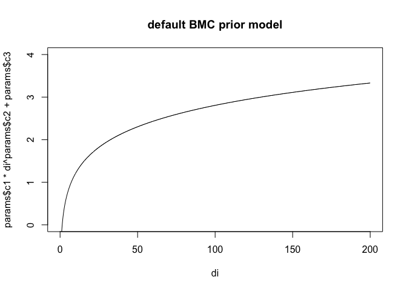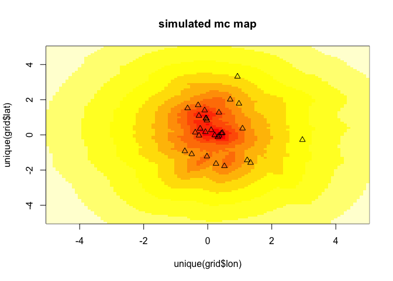

The default BMC prior is the model obtained by Mignan et al. (2011) for the Taiwanese earthquake catalogue. It remains the default BMC model, as it represents the best constrained fit so far (lowest residual, well defined over a large $d_k$ range). Note in the code that the function `d.geogr2km` calculates distances (in km) between geographical points. The map shown above is a so-called predicted $m_c$ map (see also step 2). Such approach can be used to quickly assess the number of seismic stations and the network spatial distribution required to reach a given completeness level (e.g., Kraft et al., 2013 for an example of seismic network planning).

We will now compare the priors obtained for southern California, when using `support = "calibrated"` or `support = "data"`. Note that if the model cannot be fitted to the data (when using `support = "data"` in the function `bmc.prior`), the default prior is used instead (equivalent to `support = "calibrated"`).


```r
model.calibrated <- rseismNet::bmc.prior(mc.grid, stations, kth = 5)
model.data <- rseismNet::bmc.prior(mc.grid, stations, kth = 5, support = "data")
params.cal <- model.calibrated[[1]]
params.dat <- model.data[[1]]
data <- model.calibrated[[2]]
di <- seq(0, max(data$d.kth), .1)
plot(data$d.kth, data$mc.obs, main = "BMC prior model fitting")
lines(di, params.cal$c1*di^params.cal$c2+params.cal$c3, col="orange")
lines(di, params$c1 * di ^ params$c2 + params$c3, col = "red")
lines(di, params.dat$c1*di^params.dat$c2+params.dat$c3, col="brown")
```

<!-- -->

The model calibration consists in shifting the default prior (here in red) along the $m_c$-axis (in orange), correcting $c_3$ by adding the mean residual between observations and default prior. The model obtained directly from the data (in brown) deviates from the calibrated model at large distances only. The simplest option is to use the calibration method. If using a new model parameterization is preferred, additional steps would be required: once the model is defined from a high-resolution $m_c$ map (here in brown, low `dbin` and `mapping = "grid"` in `mc.geogr`), $m_c$ should be remapped with `mapping = "circle.opt"`, and `params` the new prior model parameter list. The model should be refitted to the new $m_c$ dataset which is optimized (see explanation below) and $m_c$ remapped again. This loop should be repeated until the prior model becomes stable (see details on this approach in Mignan et al., 2011). Note that `bmc.prior` also provides the value of the parameter `sigma`, the standard deviation of the residual (below named $\sigma_{prior}$).

For the rest of this section, we will only consider the calibrated prior model for sake of simplicity (this simple approach has already been applied successfully in a number of regions: Switzerland, Mainland China, Greece, California, Iceland: Kraft et al., 2013; Mignan et al., 2013; Mignan and Chouliaras, 2014; Tormann et al., 2014; Panzera et al., 2017 - it is the only approach so far available in the `bmc` wrapper).

### Step 1: Observed $m_c$ mapping

The BMC Bayesian approach consists in combining the observed and predicted $m_c$ maps into a posterior $m_c$ map. The observed $m_c$ map is obtained by using the option `mapping = "circle.opt"` in the function `mc_geogr`. This yields the optimized $m_c$ map (with values $m_c^{obs}$), the sample size per cell being optimized by

$R = \frac{1}{2} \big[ \big(\frac{c_1 d_k^{c_2}+\sigma_{prior}}{c_1}\big)^{1/c_2} - \big(\frac{c_1 d_k^{c_2}-\sigma_{prior}}{c_1}\big)^{1/c_2} \big]$

This limits the trade-off between undersampling and over-smoothing and minimizes $m_c$ heterogeneities in space (see the detailed explanation in Mignan et al., 2011). Since we use the default prior (`params = NULL`), we can simply code:


```r
mc.opt <- rseismNet::mc.geogr(seism, "mode", "circle.opt", dbin = 0.1, stations = stations, n.bootstrap = 200)
image(matrix(mc.opt$mc.obs, nrow=length(unique(mc.opt$lon)), ncol=length(unique(mc.opt$lat))), main = "optimized obs. mc map")
```

<!-- -->

It is important to indicate the number of bootstraps to compute the standard error associated with $m_c$ observations (below named $\sigma_{obs}$). Note the improvement in $m_c$ mapping compared to the high resolution map (less gaps), and compared to the constant $R$ maps (less over-smoothing). BMC computes $m_c$ using the mode because it is assumed that $m_c$ spatial heterogeneities have been minimized when using `mapping = "circle.opt"` and that the local FMD shape is more angular than curved (this might not always be the case, but can be corrected later on, see below).

### Step 2: Predicted $m_c$ mapping

The default prior model should then be calibrated to the optimized observations, which will update both $c_3$ and $\sigma_{prior}$. We then compute $m_c^{pred}$ for each cell.


```r
prior <- rseismNet::bmc.prior(mc.opt, stations, kth = kth, support = "calibrated")
mc.pred <- (prior[[1]]$c1 * prior[[2]]$d.kth ^ prior[[1]]$c2 + prior[[1]]$c3)
sigma.pred <- rep(prior[[1]]$sigma, nrow(mc.opt))

image(matrix(mc.pred, nrow=length(unique(mc.opt$lon)), ncol=length(unique(mc.opt$lat))), main = "predicted mc map")
```

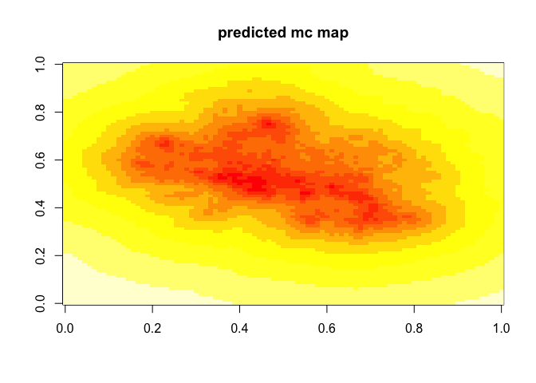<!-- -->

### Step 3: Posterior $m_c$ mapping

Now that the optimized observed $m_c^{obs}$ map (step 1) and predicted $m_c^{pred}$ map (step 2) have been produced (`mc.opt` and `mc.pred`, respectively), we can compute the posterior $m_c^{post}$ value for each cell, following Bayes' Theorem:

$m_c^{post} = \frac{m_c^{pred}\sigma_{obs}^2+m_c^{obs}\sigma_{pred}^2}{\sigma_{pred}^2+\sigma_{obs}^2}$

The posterior standard deviation is also calculated:

$\sigma_{post} = \sqrt{\frac{\sigma_{pred}^2\sigma_{obs}^2}{\sigma_{pred}^2+\sigma_{obs}^2}}$

This is done via the function `bmc.bayes`. Be careful, here both `mc.pred` and `sigma.pred` must be vectors while `mc.obs` is the data frame resulting from the function `mc.geogr`, which includes $m_c^{obs}$, $\sigma_{obs}$, and the geographic coordinates.


```r
bmc.res <- rseismNet::bmc.bayes(mc.opt, mc.pred, sigma.pred)
image(matrix(bmc.res$mc.post, nrow=length(unique(bmc.res$lon)), ncol=length(unique(bmc.res$lat))), main = "posterior mc map")
```

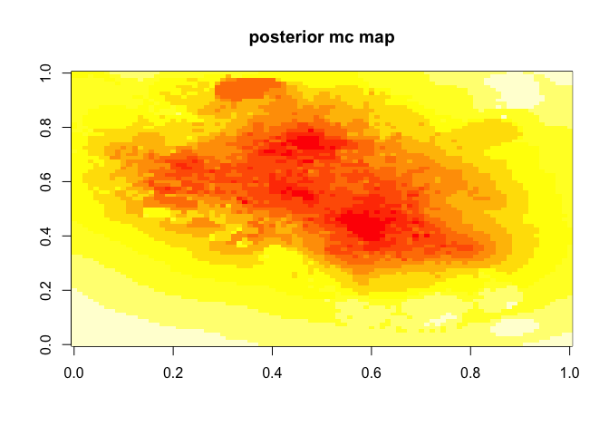<!-- -->

The $m_c^{post}$ map finally represents the so-called BMC map (here identical to the one directly provided by the BMC wrapper, as we just reproduced steps 1 to 3 of that function). Finally, let us quickly have a look at the 3 uncertainty maps (the same color range should be used for proper comparison):


```r
image(matrix(bmc.res$sigma.obs, nrow=length(unique(bmc.res$lon)), ncol=length(unique(bmc.res$lat))), main = "observed sigma map")
image(matrix(bmc.res$sigma.pred, nrow=length(unique(bmc.res$lon)), ncol=length(unique(bmc.res$lat))), main = "predicted sigma map")
points(stations$lon, stations$lat, pch = 2)
image(matrix(bmc.res$sigma.post, nrow=length(unique(bmc.res$lon)), ncol=length(unique(bmc.res$lat))), main = "posterior sigma map")
```

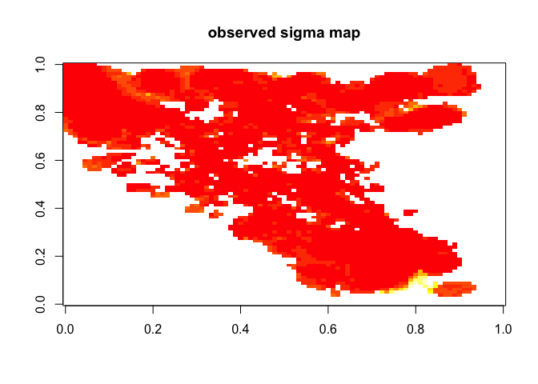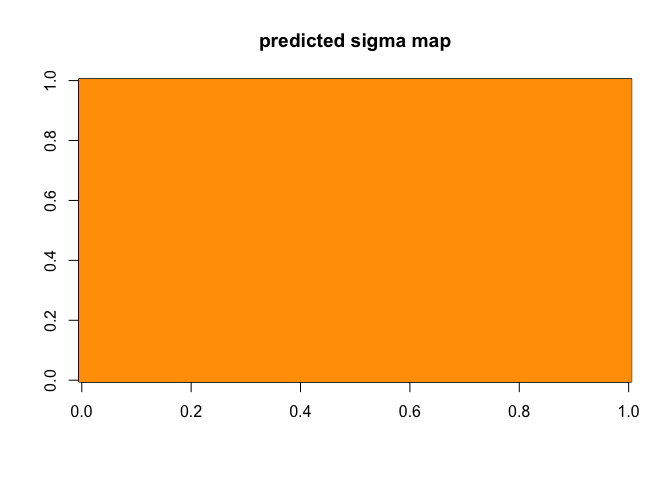

Due to $m_c$ ambiguity, results should always be verified by comparing $\max(m_c^{post})$ in a given spatial area to the matching FMD. If the $m_c$ estimate seems to be underestimated, one can use $m_c = m_c^{post}+n \sigma_{post}$ instead, as discussed in the previous section (for a tutorial-like article on the matter, see Mignan and Chouliaras, 2014).


## References

Aki, K. (1965), Maximum likelihood estimate of b in the formula log N = a - bM and its confidence limits, Bull. Earthquake Res. Inst. Univ. Tokyo, 43, 237-239

Amorese, D. (2007), Applying a Change-Point Detecion Method on Frequency-Magnitude Distributions, Bull. Seismol. Soc. Am., 97, 1742-1749, doi: 10.1785/0120060181

Gutenberg, B., Richter, C.F. (1944), Frequency of earthquakes in California, Bull. Seismol. Soc. Am., 34, 184-188

Hauksson, E., Yang, W., Shearer, P.M. (2012), Waveform Relocated Earthquake Catalog ofr Southern California (1981 to June 2011), Bull. Seismol. Soc. Am., 102, 2239-2244, doi: 10.1785/0120120010

Kijko, A., Smit, A. (2017), Estimation of the Frequency-Magnitude Gutenberg-Richter b-Value without Making Assumptions on Levels of Completeness, Seismol. Res. Lett., 88, 311-318, doi: 10.1785/0220160177

Kraft, T., Mignan, A., Giardini, D. (2013), Optimization of a large-scale microseismic monitoring network in northern Switzerland, Geophys. J. Int., 195, 474-490, doi: 10.1093/gji/ggt225

Mignan, A., Werner, M.J., Wiemer, S., Chen, C.-C., Wu, Y.-M. (2011), Bayesian Estimation of the Spatially Varying Completeness Magnitude of Earthquake Catalogs, Bull. Seismol. Soc. Am., 101, 1371-1385, doi: 10.1785/0120100223

Mignan, A. (2012), Functional shape of the earthquake frequency-magnitude distribution and completeness magnitude, J. Geophys. Res., 117, B08302, doi: 10.1029/2012JB009347

Mignan, A., Woessner, J. (2012), Estimating the magnitude of completeness for earthquake catalogs, Community Online Resource for Statistical Seismicity Analysis, doi: 10.5078/corssa-00180805, http://www.corssa.org/export/sites/corssa/.galleries/articles-pdf/Mignan-Woessner-2012-CORSSA-Magnitude-of-completeness.pdf

Mignan, A., Jiang, C., Zechar, J.D., Wiemer, S., Wu, Z., Huang, Z. (2013), Completeness of the Mainland China Earthquake Catalog and Implications for the Setup of the China Earthquake Forecast Texting Center, Bull. Seismol. Soc. Am., 103, 845-859, doi: 10.1785/0120120052

Mignan, A., Chouliaras, G. (2014), Fifty Years of Seismic Network Performance in Greece (1964-2013): Spatiotemporal Evolution of the Completeness Magnitude, Seismol. Res. Lett., 85, 657-667 doi: 10.1785/0220130209

Mignan, A., Chen, C.-C. (2016), The Spatial Scale of Detected Seismicity, Pure Appl. Geophys., 173, 117-124, doi: 10.1007/s00024-015-1133-7

Ogata, Y., Katsura, K. (1993), Analysis of temporal and spatial heterogeneity of magnitude frequency distribution inferred from earthquake catalogues, Geophys. J. Int., 113, 727-738

Ogata, Y., Katsura, K. (2006), Immediate and updated forecasting of aftershock hazard, Geophys. Res. Lett., 33, L10305, doi: 10.1029/2006GL025888

Panzera, F., Mignan, A., Vogfjord, K.S. (2017), Spatiotemporal evolution of the completeness magnitude of the Icelandic earthquake catalogue from 1991 to 2013, J. Seismol., 21, 615-630, doi: 10.1007/s10950-016-9623-3

Ringdal, F. (1975), On the estimation of seismic detection thresholds, Bull. Seismol. Soc. Am., 65, 1631-1642

Tormann, T., Wiemer, S., Mignan, A. (2014), Systematic survey of high-resolution b value imaging along Californian faults: inference on asperities, J. Geophys. Res. Solid Earth, 119, 2029-2054, doi: 10.1002/2013JB010867

Vasquez, R., Guenni, L. (n.d.), Bayesian Estimation of the Spatial Variation of the Completeness Magnitude for the Venezuelan Seismic Catalogue, http://www.statistics.gov.hk/wsc/CPS204-P47-S.pdf

Vorobieva, I., Narteau, C., Shebalin, P., Beauducel, F., Nercessian, A., Clouard, V., Bouin, M.-P. (2013), Multiscale Mapping of Completeness Magnitude of Earthquake Catalogs, Bull. Seismol. Soc. Am., 103, 2188-2202, doi: 10.1785/0120120132

Wiemer, S., Wyss, M. (2000), Minimum Magnitude of Completeness in Earthquake Catalogs: Examples from Alaska, the Western United States, and Japan, Bull. Seismol. Soc. Am., 90, 859-869
